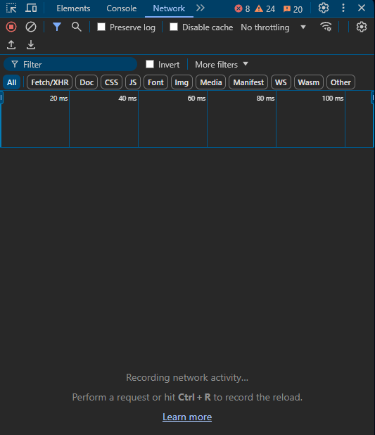
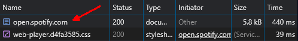

# LyricsStatus V3

## What is it?

LyricsStatus is a tool that changes your Discord status to lyrics of songs you listen to on Spotify!

It is written in TypeScript and runs on Node.js.

## Precautions

Before you proceed to [Setup](#Setup) please read those precautions.

This tool is provided "AS IS" and doesn't have any warranty that it will work on your machine.

I, creator of the LyricsStatus, am not responsible for any consequences that LyricsStatus can lead to.

By using it, you agree with the statements above.

## Setup

### Node.js

Firstly, you need to [download](https://nodejs.org/en) Node.js.

LyricsStatus needs version 17.x.x or higher.

### Downloading LyricsStatus

You can download it using Git or going to [Releases](https://github.com/OvalQuilter/lyrics-status/releases) and downloading source code archive. Then unpack it to the place you want.

For Git, use this command:

```
git clone --single-branch --branch v3 https://github.com/OvalQuilter/lyrics-status
```

### Locating to LyricsStatus

#### Windows & Linux

Copy the path to the LyricsStatus folder, often found on top of your File Explorer (`C:\Users\your_profile_name\path\to\LyricsStatus` or `/usr/name/path/to/LyricsStatus` for example).

For Windows, press `Win + R` and type `cmd`, then press `Run`.

For Linux, you need to manually open Terminal from your start menu.

In the opened window type `cd paste_path_you_copied` and press `Enter`.

### Installing modules

Now, you need to install modules. In the command prompt, run the following command:

```
npm install
```

Then wait for modules to install.

### Running and configuring

Run `npm run start` to start LyricsStatus.

Now you need to configure it. Open `localhost:8999` in your browser, you should see a menu with various settings.

First, you need to get your Discord token. [Here's](https://www.youtube.com/watch?v=LnBnm_tZlyU) a nice video on how to do it.

After getting your token you need to paste it, head back to the menu and paste it in the `Token` input field. Remove quotes if there are any.

Second, you need to get your Spotify cookies. Open [Spotify](https://open.spotify.com/) in your browser, then press `F12` or `Ctrl + Alt + I`, depending on your browser.

Head to the `Network` tab or similar, you should see something like this:



Now reload the page, wait for it to load, and search for something like `open.spotify.com` (often it's appear on top):



Click on it, in the opened window search for `Cookie:`, it's your cookies. Copy and paste them in `Cookie` input field in the menu.

Start some song in Spotify, if it has lyrics, you should see current lyrics in your command prompt as well as in your Discord status.

### Troubleshooting

#### Windows

Try running command line with administrator privileges or disabling your firewall.

#### Linux

Try running Terminal from `su` user.

