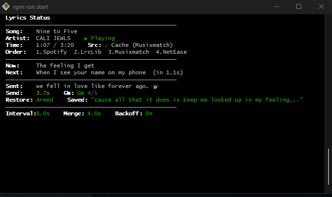
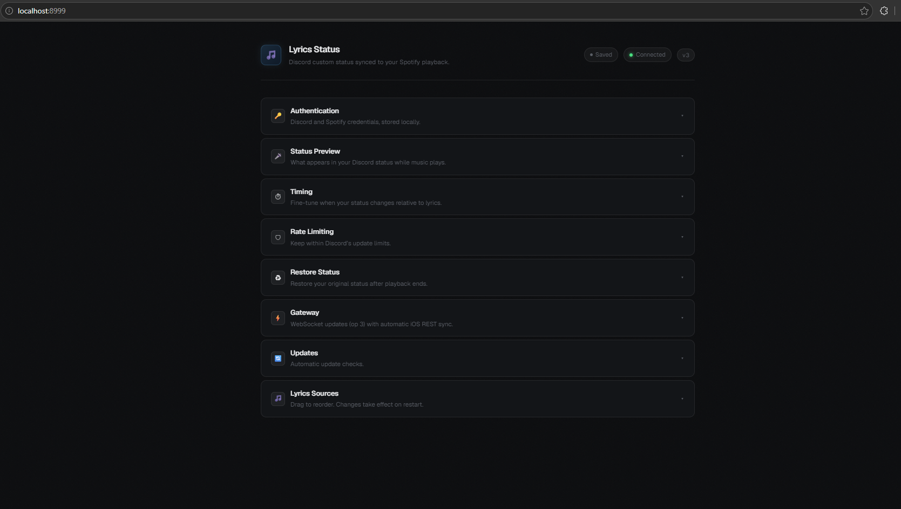

# lyrics-status

> Fork of [OvalQuilter/lyrics-status](https://github.com/OvalQuilter/lyrics-status) (v3.0.7). The original repo is no longer maintained — this is the actively maintained continuation.



Syncs your Discord custom status to live Spotify lyrics. Configured via a browser panel at `localhost:8999`.

---

## Features

| | |
|---|---|
| **6 lyric sources** | Spotify, Musixmatch, LrcLib, NetEase, QQ Music, Genius — toggled and reordered from the panel |
| **Gateway mode** | Sends via WebSocket (op 3) instead of REST, bypassing rate limits entirely |
| **Status restore** | Saves and restores your Discord status after playback ends |
| **Status flash** | Cycles presence orb color on a configurable interval while lyrics play |
| **Rich presence** | Shows lyrics as a Discord "Listening to" activity (gateway only) |
| **Fake mobile** | Identifies as Discord Android to show mobile presence indicator |
| **Template variables** | `{lyrics}` `{timestamp}` `{song_name}` `{song_author}` `{source}` `{progress}` `{duration}` `{line_number}` |
| **Unicode styles** | Bold, italic, sans, fraktur, double-struck — optionally alternating on a timer |
| **Smart truncation** | Drops whole lines before cutting words; Unicode and emoji safe |
| **Line merging** | Joins nearby lyric lines into one status update to reduce API calls |
| **Chinese conversion** | Optional Simplified ↔ Traditional conversion |

---

## Requirements

- Node.js v17+
- Spotify account (free or premium)
- Discord account

---

## Quick start

```bash
git clone --single-branch --branch v3 https://github.com/RamenFighter03/lyrics-status
cd lyrics-status
npm install
npm start
```

> ⚠️ **Downloaded a zip from GitHub?** The auto-generated zip archives may be missing pre-built files. Always use `git clone` as shown above.

Open **http://localhost:8999** to configure.

---

## Setup

### Discord token

Paste your Discord user token into the **Authentication** section and click **Verify**.

> ⚠️ Never share your token. Using user tokens is against Discord's ToS — proceed at your own risk.

### Spotify cookies

1. Open [open.spotify.com](https://open.spotify.com) while logged in
2. `F12` → **Application** → **Cookies** → `https://open.spotify.com`
3. Copy the value of `sp_dc` and paste it into **Spotify cookies**


### Musixmatch (optional)

Tokens are fetched automatically — no setup needed. To use your own: DevTools → **Application** → **Cookies** → `musixmatch.com` → copy `musixmatchUserToken`.

### Gateway (optional, recommended)

Enable **Gateway** in the panel to send updates via WebSocket instead of REST. Eliminates rate limiting. Falls back to REST automatically if disconnected.

---

## Panel



---

## Troubleshooting

| Problem | Fix |
|---|---|
| No lyrics | Check Spotify cookies are fresh and a lyrics-supported song is playing |
| `RBAC: access denied` | Re-paste a fresh `sp_dc` from DevTools |
| Status not updating | Re-verify your Discord token |
| Rate limited (HTTP 429) | Enable Gateway or raise the minimum send interval |
| Musixmatch stopped | Known bot-detection issue — use LrcLib as primary fallback |
| Source changes not taking effect | Restart required after reordering or toggling sources |

---

## Disclaimer

Provided "AS IS". No warranty. The original author and this fork's maintainer accept no responsibility for consequences of use.