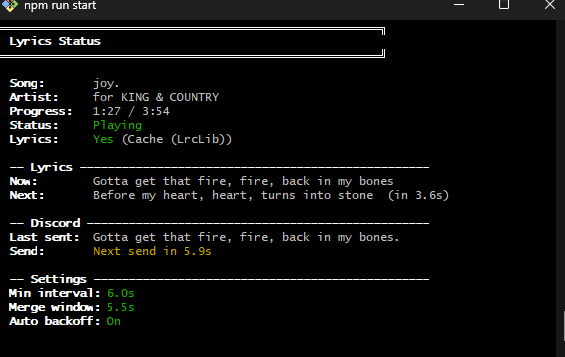
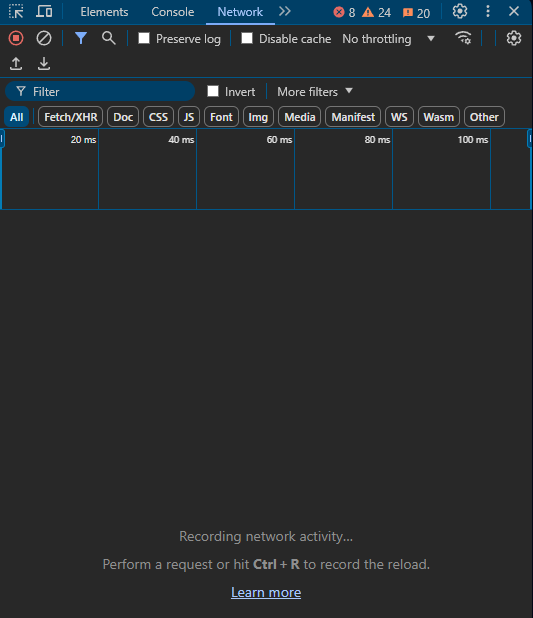
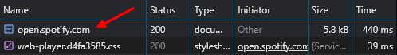

# lyrics-status — RamenFighter03 fork

> Based on [OvalQuilter/lyrics-status](https://github.com/OvalQuilter/lyrics-status) (v3.0.7). All credit to the original author.
> Full change history in [CHANGELOG_old.txt](CHANGELOG_old.txt) (entries 1–46) and [CHANGELOG.txt](CHANGELOG.txt) (entries 47+).



Polls Spotify every 5 seconds and updates your Discord custom status with the current synced lyric line in real time. Runs on Node.js with a settings panel at `localhost:8999`.

---

## What's new in this fork

- **Musixmatch** — widest synced lyrics catalog of any source, including songs Spotify doesn't show lyrics for. Token is fetched automatically, no manual setup needed.
- **5 lyric sources** — Spotify, Musixmatch, LrcLib, NetEase, QQ Music. Toggle and reorder them from the panel. Falls through to the next source automatically.
- **Discord gateway** — sends status via WebSocket op 3 instead of REST, bypassing the ~1/3s REST rate limit entirely.
- **Status restore** — saves your Discord status before the app starts and restores it after music stops.
- **Rate limit handling** — auto backoff on 429s, configurable minimum send interval, lyric line merging to reduce API calls.
- **Smart truncation** — drops whole lines before word-chopping; Unicode/emoji safe.
- **Song skip detection** — detects manual skips immediately and clears stale lyric state.
- **Template variables** — customize the status format with `{lyrics}`, `{timestamp}`, `{source}`, `{progress}`, `{duration}`, `{line_number}`.
- **Chinese script conversion** — optional Simplified ↔ Traditional conversion via opencc-js.

---

## Requirements

- [Node.js](https://nodejs.org/en) v17 or higher
- A Spotify account (free or premium)
- A Discord account

---

## Quick start

```bash
git clone --single-branch --branch v3 https://github.com/RamenFighter03/lyrics-status
cd lyrics-status
npm install
npm start
```

Open `http://localhost:8999` to configure.

---

## Configuration

### 1. Discord token

Get your Discord user token ([how-to video](https://www.youtube.com/watch?v=LnBnm_tZlyU)) and paste it into the **Discord token** field. Click **Check** to verify.

> ⚠️ Never share your Discord token. Using user tokens is against Discord's ToS — proceed at your own risk.

### 2. Spotify cookies

The app needs your Spotify `sp_dc` cookie to fetch lyrics.

1. Open [open.spotify.com](https://open.spotify.com) while logged in.
2. Press `F12` → **Application** tab → **Cookies** → `https://open.spotify.com`.
3. Find the `sp_dc` cookie and copy its **value** (just the value, not the full cookie string).
4. Paste it into the **Spotify cookies** field in the panel.




### 3. Musixmatch (optional)

Musixmatch tokens are fetched and rotated automatically — no setup needed. If you want to provide your own token:

1. Go to [musixmatch.com](https://www.musixmatch.com) and log in.
2. Open DevTools → **Application** → **Cookies** → `https://www.musixmatch.com`.
3. Find `musixmatchUserToken`, copy the full value.
4. Paste it into the **Musixmatch token** field. The token is extracted automatically.

Leaving it blank is fine. The app falls through to LrcLib, NetEase, and QQ Music automatically.

### 4. Spotify OAuth (optional)

A [Spotify developer app](https://developer.spotify.com/dashboard) (**Client ID**, **Client secret**, **Redirect URI**) enables OAuth-based playback access. Cookies alone are sufficient for lyrics — this is only needed for playback control.

### 5. Gateway (optional, recommended)

Enable **Gateway** in the panel to send status updates via Discord's WebSocket instead of REST. This removes the REST rate limit entirely. If the gateway disconnects, the app falls back to REST automatically.

---

## Run modes

| Command | Mode | Notes |
|---|---|---|
| `npm start` | Discord custom status | Uses your user token. Subject to REST rate limit unless gateway is enabled. |
| `npm run rpc` | Discord Rich Presence | Uses local IPC. No rate limit. Doesn't require a user token. |

---

## Troubleshooting

| Problem | Fix |
|---|---|
| No lyrics showing | Check that Spotify cookies are fresh and a song with lyrics is playing |
| Spotify "RBAC: access denied" | Cookies expired — re-paste fresh `sp_dc` from DevTools |
| Discord status not updating | Verify your Discord token with the Check button |
| Rate limited (429) | Enable Gateway in the panel, or raise the minimum interval in Rate Limiting settings |
| Panel shows blank page | Restart the app and hard-refresh (`Ctrl+Shift+R`) |
| Musixmatch not working | It uses bot-detection-prone tokens. LrcLib is the recommended stable fallback. |

**Windows:** If the app won't start, try running as Administrator or disabling your firewall temporarily.

**Linux:** Try running as `su`.

---

## Notes

### iOS status sync

The codebase includes REST sync logic (`_iOSSyncPending`, `_onGatewayReady`) that fires after each song change and on gateway reconnect. This exists because Discord's gateway op 3 updates don't persist to iOS — the iOS client caches its own session state and misses gateway-only updates. If you don't use Discord on iOS this code is harmless.

---

## Disclaimer

Provided "AS IS" with no warranty. The original author (OvalQuilter) and this fork's maintainer take no responsibility for any consequences of use.