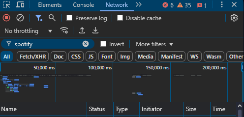

# LyricsStatus V3

## Overview

**LyricsStatus** is a tool that automatically updates your Discord status with the lyrics of songs you're listening to on Spotify. It is written in **TypeScript** and runs on **Node.js**.

## Disclaimer

Before proceeding with the setup, please read the following:

- This tool is provided **"AS IS"**, without any warranties regarding its functionality or compatibility with your system.
- The creator of **LyricsStatus** is **not responsible** for any consequences arising from its usage.
- By using this tool, you **agree** to these terms.

---

## Installation Guide

### 1. Install Node.js

Ensure you have Node.js installed. You can download it from the official website:

🔗 [Download Node.js](https://nodejs.org/en)

> [!IMPORTANT]
> **LyricsStatus** requires **Node.js version 17.x.x or higher**.

### 2. Download LyricsStatus

There are two ways to download LyricsStatus:

#### Option 1: Using Git

> [!NOTE] 
> This option requires **Git** to be installed.
> You can download it from the official website: [https://git-scm.com/](https://git-scm.com/)

Run the following command in your terminal:

```sh
git clone --single-branch --branch v3 https://github.com/OvalQuilter/lyrics-status
```

#### Option 2: Downloading from Releases

1. Visit the [**Releases**](https://github.com/OvalQuilter/lyrics-status/releases) page.
2. Download the latest source code archive.
3. Extract the files to a directory of your choice.

### 3. Navigate to the LyricsStatus Directory

#### **Windows & Linux**

1. Copy the path to the **LyricsStatus** folder:
    - Example (Windows): `C:\Users\your_profile_name\path\to\LyricsStatus`
    - Example (Linux): `/home/your_name/path/to/LyricsStatus`
    
   📌 **Example screenshot:**

   
2. Open a terminal:
    - **Windows**: Press `Win + R`, type `cmd`, and press `Enter`.
    - **Linux**: Open **Terminal** from your applications menu.
3. Change to the LyricsStatus directory using:
   ```sh
   cd /path/to/LyricsStatus
   ```
   
   📌 **Example screenshot:**

   

### 4. Install Dependencies

Run the following command to install required modules:

```sh
npm install
```

Wait for the installation to complete.

### 5. Start LyricsStatus

Launch LyricsStatus with:

```sh
npm run start
```

### 6. Configure LyricsStatus

Open your browser and go to:

🔗 [http://localhost:8999](http://localhost:8999)

You should see a settings menu.

#### **Step 1: Obtain Your Discord Token**

1. Follow this [video guide](https://www.youtube.com/watch?v=LnBnm_tZlyU) to get your Discord token.
2. Copy the token and paste it into the **Token** input field in the LyricsStatus settings.
3. Remove any quotation marks if any.

#### **Step 2: Get Your Spotify Cookies**

1. Open [**Spotify Web**](https://open.spotify.com/) in your browser.
2. Open **Developer Tools**:
    - Press `F12` or `Ctrl + Shift + I` (Windows/Linux)
    - Press `Cmd + Option + I` (Mac)
3. Navigate to the **Network** tab.

> [!NOTE]
> You may need to press the `>>` button, and then select the **Network** tab.

📌 **Example screenshot:**



4. Reload the page and look for the first request in the list (usually `open.spotify.com`).

📌 **Example screenshot:**:


5. Click on the request, find the **Cookie** header, copy its contents, and paste it into the **Cookie** input field in the LyricsStatus settings.

### 7. Verify the Setup

- Start playing a song on Spotify.
- If the song has lyrics, they should appear in both your **command prompt** and **Discord status**.

> [!IMPORTANT]
> Check the cookies for any extra characters, such as spaces or newlines.

---

## Troubleshooting

### Windows

- Try running the **Command Prompt** as an administrator.
- Temporarily disable your **firewall** if necessary.

### Linux

- Try running the **Terminal** as a **root user** (`su`).

---

## **TODO**:

- [ ] Allow to turn off specific lyrics providers
- [ ] More advanced debugging system
- [ ] Rewrite the UI (again) (in progress)
- [ ] Add more playback platforms (YouTube Music, Deezer etc.) (if possible)
- [ ] ...or any other feature you can think of

---
